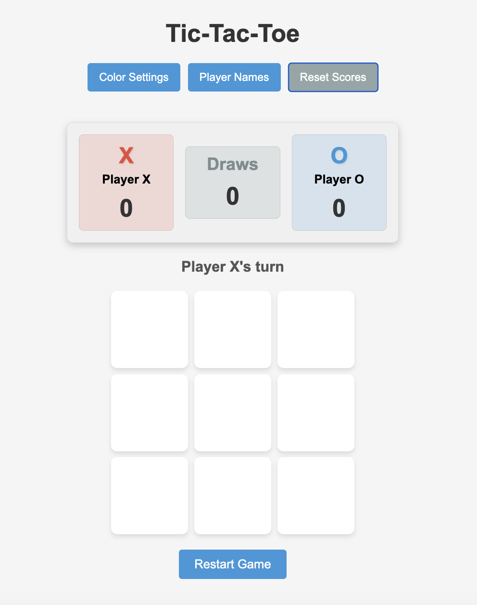

## How to Use

1. **Start a New Game**: The game starts automatically when the page loads. Player X goes first.
2. **Make a Move**: Click on any empty cell to place your mark (X or O).
3. **Win the Game**: Connect three of your marks horizontally, vertically, or diagonally to win.
4. **Restart**: Click the "Restart Game" button to start a new game at any time.
5. **Change Theme**: Toggle between light and dark mode using the switch in the top-right corner.
6. **Customize Colors**: Click the "Color Settings" button to open a modal where you can choose custom colors for both players.

The game automatically saves your theme preference and color choices for future visits.# Tic-Tac-Toe Game

A simple, interactive Tic-Tac-Toe game built with HTML, CSS, and JavaScript.



## Description

This project is a classic two-player Tic-Tac-Toe game implemented as a web application. Players take turns placing their marks (X or O) on a 3×3 grid. The first player to align three of their marks horizontally, vertically, or diagonally wins the game.

## Features

- Interactive game board with visual feedback
- Turn-based gameplay for two players (X and O)
- Win detection and highlighting
- Draw detection
- Game state tracking
- Restart functionality
- Responsive design
- Dark/light theme toggle with preference saving
- Customizable player colors via a modal interface
- Settings persistence using localStorage

## Technologies Used

- HTML5
- CSS3
- JavaScript (ES6)

## Project Structure

```
tic-tac-toe/
├── index.html      # Main HTML file with game structure
├── styles.css      # CSS styling for the game
├── script.js       # JavaScript for game logic
└── README.md       # Project documentation
```

## How to Run Locally

1. Clone or download this repository to your local machine
2. Open the project folder
3. Double-click on `index.html` to open in your default web browser

Alternatively:
- Drag and drop the `index.html` file into an open browser window
- Or use the "Open File" function in your browser (Ctrl+O or Cmd+O) to navigate to and open the file

## Future Enhancements

Potential improvements and additions to the game:

- Score tracking across multiple games
- Single-player mode with AI opponent
- Animations for game actions
- Sound effects
- Custom player names
- Difficulty levels
- Game timer
- Alternate themes or skins
- Game history and replay feature
- Multiplayer over network

## License

[MIT License](https://opensource.org/licenses/MIT)

## Credits

Created as a portfolio project for demonstrating front-end web development skills.

## Contact

[Your Name] - [your.email@example.com]